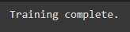
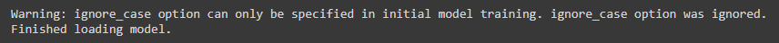
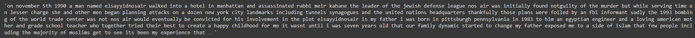

# Naive Bayes Space Restorer

A Python class to allow enable convenient training of a Naive Bayes-based statistical model for restoration of spaces to unsegmented streams of input characters.

E.g.
`thisisasentence -> this is a sentence`

The model is based on the description and Python code in Norvig (2009), and the chunking methods for handling long strings is borrowed from Jenks (2018).

The implementation here allows for easy restoration of spaces to entire datasets of documents with a progress bar, and for tuning of hyperparameters _L_ (maximum word length) and λ (smoothing parameter) for model optimization.

## Getting started

### 1. Clone the repository

Recommended method for Google Colab notebooks:

```python
import sys
# Delete naive-bayes-space-restorer folder if it exists to ensure that any changes to the repo are reflected
!rm -rf 'naive-bayes-space-restorer'
# Clone naive-bayes-space-restorer repo
!git clone https://github.com/ljdyer/naive-bayes-space-restorer.git
# Add naive-bayes-space-restorer/src to PYTHONPATH
sys.path.append('naive-bayes-space-restorer/src')
```

### 2. Install requirements

If working in Google Colab, the only requirement is `python-memo`. All other requirements are installed by default.

```python
!pip install python-memo
```

If working in a virtual environment, run the following:

```python
pip install -r requirements.txt
```

### 3. Import NBSpaceRestorer class

```python
from nb_space_restorer import NBSpaceRestorer
```

## How to use

### Initialize an instance of NBSpaceRestorer

```python
# ====================
class NBSpaceRestorer():

    # ====================
    def __init__(self,
                 train_texts: list = None,
                 save_path: str = None,
                 load_path: str = None,
                 L: int = 20,
                 lambda_: float = 10.0,
                 ignore_case: bool = True):
        """Initialize an instance of the NBSpaceRestorer class

        Required arguments:
        -------------------
        exactly ONE of EITHER:

        train_texts: list = None    A list of 'gold standard' documents
                                    (i.e. correctly spaced sequences of
                                    words) on which to train the model.

        OR

        load_path: str = None       The path to a pickle file containing
                                    a dictionary with keys 'unigram_freqs'
                                    and 'bigram_freqs' containing Counter
                                    objects.

        Optional keyword arguments:
        ---------------------------
        save_path: str = None       If training a new model with train_texts,
                                    the path to save the pickle file of unigram
                                    and bigram frequencies.
                                    Ignored if loading previously saved
                                    frequencies using load_path.

        L: int = 20                 The maximum possible word length to
                                    consider during inference. Inference
                                    time increases with L as more probabilities
                                    need to be calculated.

        lambda_ = 10.0              The smoothing parameter to use during
                                    inference. Higher values of lambda_ cause
                                    higher probabilities to be assigned to
                                    words not learnt during training.

        ignore_case: bool           Ignore case during training (so that e.g.
            = False                 'banana', 'Banana', and 'BANANA' are all
                                    counted as occurences of 'banana').
                                    Ignored if loading previously saved
                                    frequencies using load_path.
        """
```

#### Example 1: Train a model with new texts

```python
from google.colab import drive
drive.mount('/content/drive')

TRAIN_PATH = 'drive/MyDrive/PAPER/data/ted_talks/ted_train.csv'
train_df = pd.read_csv(TRAIN_PATH)
train_texts = train_df['all_cleaned'].to_list()

NB_Ted = NBSpaceRestorer(
    train_texts=train_texts,
    save_path='drive/MyDrive/PAPER/models/01_nb/ted_train.pickle',
    L=20,
    lambda_=10.0,
    ignore_case=True
)
```

</img>

#### Example 2: Load a trained model

Hyperparameters _L_ and λ are not applied until inference, so new values can be specified when loading previous trained models.

`ignore_case` is applied during traning, so should not be specified when training a new model (if it is specified, it will be ignored).

```python
NB_Ted = NBSpaceRestorer(
    load_path='drive/MyDrive/PAPER/models/01_nb/ted_train.pickle',
    L=15,
    lambda_=12,
    ignore_case=False
)
```

</img>

#### Example 3: Change model hyperparameters

Hyperparameters _L_ and λ are not applied until inference, so they can be changed at any time.

```python
NB_Ted.L = 17
NB_Ted.lambda_ = 14
```

### Run inference on new texts

```python
    # ====================
    def restore(self, texts: Str_or_List) -> str:
        """Restore spaces to either a single string, or a list of
        strings.

        If the input is a single string, the output will also be
        a single string.
        If the input is a list of strings, the output will be a
        list of the same length as the input.

        Required arguments:
        -------------------
        texts: Str_or_List          Either a single string of input
                                    characters, or a list of strings
                                    of input characters.
                                    Input strings should not contain
                                    spaces (e.g. 'thisisasentence')
        """

        if isinstance(texts, str):
            return self.restore_doc(texts)
        if isinstance(texts, list):
            restored = []
            texts_ = tqdm_(texts)
            for text in texts_:
                restored_ = self.restore_doc(text)
                restored.append(restored_)
                texts_.set_postfix({
                    'ram_usage': f"{psutil.virtual_memory().percent}%"
                })
            return restored
```

#### Example usage

```python
TEST_PATH = 'drive/MyDrive/PAPER/data/ted_talks/ted_test.csv'
test_df = pd.read_csv(TEST_PATH)
test_texts = test_df['no_spaces'].to_list()[:10]

hyp = NB_Ted.restore(test_texts)
```

</img>

```python
hyp[0]
```

</img>

You can also see these examples in [src/nb_space_restorer_example.ipynb](src/nb_space_restorer_example.ipynb).

See the source code for details of other class methods.

####
## References

G. Jenks, ”python-wordsegment,” July, 2018. [Online]. Available:
https://github.com/grantjenks/python-wordsegment. [Accessed May
2, 2022].

P. Norvig, “Natural language corpus data,” in Beautiful Data, T.
Segaran and J. Hammerbacher, Eds. Sebastopol: O’Reilly, 2009, pp.
219-242.
