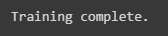
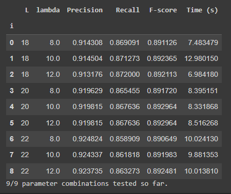
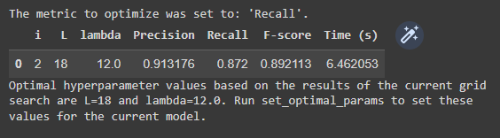
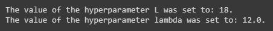
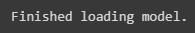
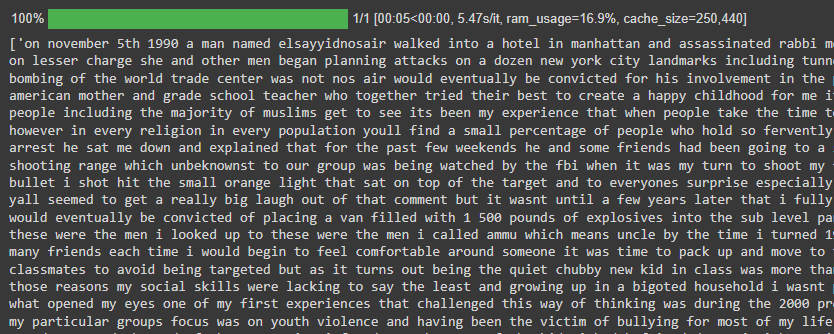

# Naive Bayes Space Restorer

A Python library for training Naive Bayes-based statistical machine learning models for restoring spaces to unsegmented sequences of input characters.

E.g.
`thisisasentence -> this is a sentence`

Developed and used for the paper "Comparison of Token- and Character-Level Approaches to Restoration of Spaces, Punctuation, and Capitalization in Various Languages", which is scheduled for publication in December 2022.

The model is based on the description and Python code in Norvig (2009), and the chunking methods for handling long strings is borrowed from Jenks (2018).

The implementation here allows for easy restoration of spaces to entire datasets of documents with a progress bar, and for tuning of hyperparameters _L_ (maximum word length) and λ (smoothing parameter) for model optimization.

## Interactive demo

The quickest and best way to get acquainted with the library is through the interactive demo [here](https://colab.research.google.com/drive/1ngcioFhOvS95oSYjkC4kqIYtBZUFygx6?usp=sharing), where you can walk through the steps involved in using the library and clean some sample data from the Ted Talks dataset used in the paper.

Alternatively, scroll down for instructions on getting started and basic documentation.

## Getting started

### Install the library using `pip`

```
!pip install git+https://github.com/ljdyer/Naive-Bayes-Space-Restorer.git
```

### Import the `NBSpaceRestorer` class

```python
from nb_space_restorer import NBSpaceRestorer
```

## Model training, optimization, and inference using the `NBSpaceRestorer` class

### Initialize and train a model

#### `NBSpaceRestorer.__init__`

```python
    # ====================
    def __init__(self,
                 train_texts: list,
                 ignore_case: bool = True,
                 save_path: Optional[str] = None):
        """Initalize and train an instance of the class.

        Args:
          train_texts (list):
            The list of 'gold standard' documents (running text with spaces)
            on which to train the model.
          ignore_case (bool, optional):
            Whether or not to ignore case during training (so that e.g.
            'banana', 'Banana', and 'BANANA' are all counted as instances
            of 'banana'). Defaults to True.
          save_path (Optional[str], optional):
            The path to a pickle file to save the model to. Defaults to None.
        """
```

#### Example usage:

```python
restorer = NBSpaceRestorer(
    train_texts=train['reference'].to_list(),
    ignore_case=True
)
```

</img>

### Run a grid search to find optimal hyperparameters for inference

#### `NBSpaceRestorer.add_grid_search`

```python
    # ====================
    def add_grid_search(self,
                        grid_search_name: str,
                        L: List[int],
                        lambda_: List[float],
                        ref: List[str],
                        input: List[str]):
        """Add and start running a grid search to find optimal hyperparameters
        for the model.

        Args:
          grid_search_name (str):
            A name for the grid search (e.g. 'grid_search_1')
          L (List[int]):
            A list of values for the hyperparameter L.
            (E.g. [18, 20, 22])
          lambda_ (List[float]):
            A list of values for the hyperparameter lambda.
            (E.g. [8.0, 10.0, 12.0])
          ref (List[str]):
            A list of reference documents to use in the grid search
          input (List[str]):
            A list of input documents to use in the grid search. Should be the
            same as the reference documents, but with spaces removed.
        """
```

#### Example usage:

```python
restorer.add_grid_search(
    grid_search_name='grid_search_1',
    L=[18, 20, 22],
    lambda_=[8.0, 10.0, 12.0],
    ref=test_ref,
    input=test_input
)
```

</img>

### Show optimal hyperparameters from the current grid search

#### `NBSpaceRestorer.show_optimal_params`

```python
    # ====================
    def show_optimal_params(self,
                            metric_to_optimize: Optional[str] = None,
                            min_or_max: Optional[str] = None):
        """Display the rows from the grid search results table with the best
        results based on the values of the metric_to_optimize and min_or_max
        attributes of the class instance, and the values of the hyperparameters
        that produce those results.
        If there is more than one hyperparameter combination that produces the
        best result for metric_to_optimize, the one that was tested first will
        be selected.

        Args:
          metric_to_optimize (Optional[str], optional):
            If provided, the metric_to_optimize attribute of the class
            instance will be set to this value before finding the optimal
            hyperparameter values.
            Defaults to None.
          min_or_max (Optional[str], optional):
            If provided, the min_or_max attribute of the class
            instance will be set to this value before finding the optimal
            hyperparameter values. Defaults to None.
        """
```

#### Example usage:

```python
restorer.show_optimal_params(metric_to_optimize='Recall')
```

</img>

### Apply the optimal hyperparameters from the current grid search

#### `NBSpaceRestorer.set_optimal_params`

```python
    # ====================
    def set_optimal_params(self,
                           metric_to_optimize: Optional[str] = None,
                           min_or_max: Optional[str] = None):
        """Set the L and lambda_ attributes of the class instances to the
        optimal hyperparameters for the model based on the values of the
        metric_to_optimize and min_or_max attributes of the class instance.

        If there is more than one hyperparameter combination that produces the
        best result for metric_to_optimize, the one that was tested first will
        be selected.

        Args:
          metric_to_optimize (Optional[str], optional):
            If provided, the metric_to_optimize attribute of the class
            instance will be set to this value before finding the optimal
            hyperparameter values.
            Defaults to None.
          min_or_max (Optional[str], optional):
            If provided, the min_or_max attribute of the class
            instance will be set to this value before finding the optimal
            hyperparameter values. Defaults to None.
        """
```

#### Example usage:

```python
restorer.set_optimal_params()
```

</img>

### Load a previously saved model from a pickle file

#### `NBSpaceRestorer.load`

```python
    # ====================
    @classmethod
    def load(cls,
             load_path: str,
             read_only: bool = False) -> 'NBSpaceRestorer':
        """Load a previously saved instance of the class.

        Args:
          load_path (str):
            The path to the pickle file that contains the model
            attributes
          read_only (bool, optional):
            If set to True, the model will be loaded but changes made after
            loading will not be written back to the pickle file.

        Returns:
          NBSpaceRestorer:
            The loaded class instance
        """

        self = cls.__new__(cls)
        self.__dict__ = load_pickle(load_path)
        if read_only is True:
            self.save_path = None
        else:
            self.save_path = load_path
        print(MESSAGE_FINISHED_LOADING)
        self.save()
        return self
```

#### Example usage:

```python
NB_TedTalks = NBSpaceRestorer.load(
    'https://raw.githubusercontent.com/ljdyer/Naive-Bayes-Space-Restorer/main/NB_TedTalks.pickle',
    read_only=True
)
```

</img>

### Restore spaces to an unsegmented sequence of input characters

#### `NBSpaceRestorer.restore`

```python
    # ====================
    def restore(self,
                texts: Union[str, List[str]],
                L: Optional[int] = None,
                lambda_: Optional[int] = None) -> Union[str, List[str]]:
        """Restore spaces to either a single string, or a list of
        strings.

        Args:
          texts (Union[str, List[str]]):
            Either a single string of input characters not containing spaces
            (e.g. 'thisisasentence') or a list of such strings
          L (Optional[int], optional):
            The value of the hyperparameter L to set before restoring
          lambda_ (Optional[float], optional):
            The value of the hyperparameter lambda_ to set before restoring

        Returns:
          Union[str, List[str]]:
            The string or list of strings with spaces restored
        """
```

#### Example usage:

```python
NB_TedTalks.restore(test_input)
```

</img>

## References

G. Jenks, ”python-wordsegment,” July, 2018. [Online]. Available:
https://github.com/grantjenks/python-wordsegment. [Accessed May
2, 2022].

P. Norvig, “Natural language corpus data,” in Beautiful Data, T.
Segaran and J. Hammerbacher, Eds. Sebastopol: O’Reilly, 2009, pp.
219-242.
