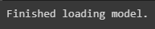
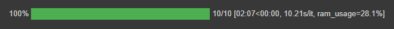
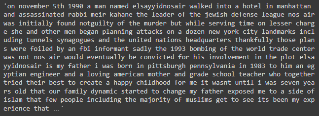

# Naive Bayes Space Restorer

A Python class to allow enable convenient training of a Naive Bayes-based statistical model for restoration of spaces to unsegmented streams of input characters.

E.g.
`thisisasentence -> this is a sentence`

The model is based on the description and Python code in Norvig (2009), and the chunking methods for handling long strings is borrowed from Jenks (2018).

The implementation here allows for easy restoration of spaces to entire datasets of documents with a progress bar, and for tuning of hyperparameters _L_ (maximum word length) and λ (smoothing parameter) for model optimization.

## Getting started

### 1. Clone the repository

Recommended method for Google Colab notebooks:

```python
import sys
# Delete naive-bayes-space-restorer folder if it exists to ensure that any changes to the repo are reflected
!rm -rf 'naive-bayes-space-restorer'
# Clone naive-bayes-space-restorer repo
!git clone https://github.com/ljdyer/naive-bayes-space-restorer.git
# Add naive-bayes-space-restorer/src to PYTHONPATH
sys.path.append('naive-bayes-space-restorer/src')
```

### 2. Install requirements

The FeatureRestorerMetricGetter class from the Feature Restorer Metric Getter library is required in order to use grid search features.

To install it in Google Colab, run the following:

```python
!rm -rf 'feature-restorer-metric-getter'
!git clone https://github.com/ljdyer/feature-restorer-metric-getter.git
sys.path.append('feature-restorer-metric-getter/src')
from feature_restorer_metric_getter import FeatureRestorerMetricGetter
```

If working in Google Colab, all other requirements are install by default.

If working in a virtual environment, run the following. You will also need to install Feature Restore Metric Getter separately.

```python
pip install -r requirements.txt
```

### 3. Import NBSpaceRestorer class

```python
from nb_space_restorer import NBSpaceRestorer
```

## How to use

Example usage for the operations covered below is also included in the example notebook: [nb_space_restorer_example.ipynb](nb_space_restorer_example.ipynb).

### Initialize an instance of NBSpaceRestorer

Training—which consists simply of constructing unigram and bigram frequency lists and takes very little time—is carried out upon initialization.

```python
# ====================
class NBSpaceRestorer():

    # ====================
    def __init__(self,
                 root_folder: str,
                 train_texts: list,
                 ignore_case: bool = True):
        """Initialize an instance of the NBSpaceRestorer class

        Required arguments:
        -------------------
        root_folder: str            The folder that will contain all instance
                                    assets.
                                    The folder should not already exist. It will
                                    be created automatically.

        train_texts: list           The list of 'gold standard' documents on
                                    which to train the model.

        Optional keyword arguments:
        ---------------------------
        ignore_case: bool           If True, case will be ignored during
            = True                  training (so that e.g. 'banana', 'Banana',
                                    and 'BANANA' are all counted as
                                    occurences of 'banana').
        """
```

Example usage:

```python
MODEL_FOLDER = 'drive/MyDrive/PAPER/models/01_nb/NB_TED'
TRAIN_PATH = 'drive/MyDrive/PAPER/data/ted_talks/ted_train.csv'
train_df = pd.read_csv(TRAIN_PATH)
train_texts = train_df['all_cleaned'].to_list()
NB_Ted = NBSpaceRestorer(
    root_folder=MODEL_FOLDER,
    train_texts=train_texts,
)
```

</img>

### Load a previously saved instance

```python
    # ====================
    @classmethod
    def load(cls, root_folder: str):
        """Load a previously saved instance of the NBSpaceRestorer class

        Required arguments:
        -------------------
        root_folder: str            The folder that contains all instance
                                    assets (i.e. the folder passed as
                                    root_folder when the instance was
                                    initialized).
        """
```

```python
MODEL_FOLDER = 'drive/MyDrive/PAPER/models/01_nb/NB_TED'
NB_Ted = NBSpaceRestorer.load(MODEL_FOLDER)
```

</img>

### Run inference on new texts

Hyperparameters _L_ and λ can be specified at inference time.

```python
    # ====================
    def restore(self,
                texts: Str_or_List,
                L: int = 20,
                lambda_: float = 10.0) -> str:
        """Restore spaces to either a single string, or a list of
        strings.

        If the input is a single string, the output will also be
        a single string.
        If the input is a list of strings, the output will be a
        list of the same length as the input.

        Required arguments:
        -------------------
        texts: Str_or_List          Either a single string of input
                                    characters, or a list of strings
                                    of input characters.
                                    Input strings should not contain
                                    spaces (e.g. 'thisisasentence')

        L: int = 20                 The maximum possible word length to
                                    consider during inference. Inference
                                    time increases with L as more probabilities
                                    need to be calculated.

        lambda_ = 10.0              The smoothing parameter to use during
                                    inference. Higher values of lambda_ cause
                                    higher probabilities to be assigned to
                                    words not learnt during training.
        """
```

#### Example usage

```python
TEST_PATH = 'drive/MyDrive/PAPER/data/ted_talks/ted_test.csv'
test_df = pd.read_csv(TEST_PATH)
test_texts = test_df['no_spaces'].to_list()[:10]
hyp = NB_Ted.restore(test_texts)
```

</img>

```python
hyp[0]
```

</img>

See the source code for details of other class methods, including grid search features.

####
## References

G. Jenks, ”python-wordsegment,” July, 2018. [Online]. Available:
https://github.com/grantjenks/python-wordsegment. [Accessed May
2, 2022].

P. Norvig, “Natural language corpus data,” in Beautiful Data, T.
Segaran and J. Hammerbacher, Eds. Sebastopol: O’Reilly, 2009, pp.
219-242.
